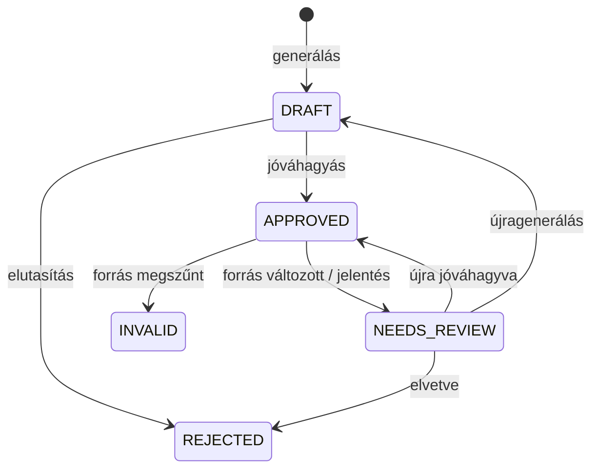
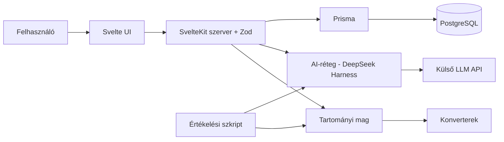

# Tananyaghoz kötött feladatgeneráló és gyakorlóalkalmazás

Kapcsolódó outline: [01-project-outline.md](01-project-outline.md)

## 1. Szereplők és jogosultságok

Egyfajta felhasználói fiók van, a szerepet a tananyaghoz vagy kérdésbankhoz fűződő viszony határozza meg. Ugyanaz a személy lehet az egyik tananyagnál tulajdonos, a másiknál tanuló. Mindenkinek tananyagonként saját kérdésbankja van, amelyet csak ő módosíthat. A megosztott tananyagot a tanuló saját jegyzetekkel bővítheti, de az eredetit nem módosíthatja.

| Szerep | Igény | Felelősség / hozzáférés |
| --- | --- | --- |
| Tananyag tulajdonosa | A saját jegyzetéből tanulni, esetleg megosztani | Feltölti és módosítja a tananyagot, ellenőrzi a darabolást, privát vagy nyilvános állapotot választ. Nyilvános tananyagnál a kérdésbankja is nyilvános. |
| Tanuló | Saját vagy megosztott tananyagból tanulni és gyakorolni | Tanul, a megosztott tananyagot saját jegyzetekkel bővítheti, kérdéseket generál a privát kérdésbankjába, használja a tulajdonos nyilvános kérdésbankját, gyakorol és jelentheti a hibás tartalmat. |
| Ellenőrzött oktató (lehetséges) | Jelezni, hogy egy tartalmat szakértőként validált | Normál fiók egy oktatói jelöléssel, amely az általa validált tartalmakon megjelenik. |
| Szerző (fejlesztő) | A módszerek mérhető összehasonlítása | Összeállítja a tesztkészletet, és szkripttel futtatja az értékelést. |
| Témavezető / értékelő | A megvalósítás ellenőrzése | Kipróbálja a fő folyamatokat, és újrafuttathatja az értékelést. |

## 2. Use case-ek / user storyk

### UC1: Tananyag feltöltése és darabolása

- **Szereplő:** Tulajdonos
- **Előfeltétel:** A felhasználó be van jelentkezve.
- **Fő folyamat:**
  1. A felhasználó feltölt vagy beilleszt egy .txt tananyagot.
  2. A konverter a belső formátumra alakítja, és felismeri a fejezeteket.
  3. A rendszer részletekre bontja, és mindegyikhez kulcsot és tartalom-hash-t rendel.
  4. A felhasználó ellenőrzi a darabolást, szükség esetén részleteket összevon vagy szétvág, majd jóváhagyja.
- **Alternatív / hibafolyamatok:** Nem támogatott, hibás vagy üres fájlnál a rendszer hibát jelez, és nem hoz létre verziót.
- **Utófeltétel:** A tananyag privát állapotban, jóváhagyott darabolással eltárolódott.

### UC2: Megosztás és könyvtárhoz adás

- **Szereplő:** Tulajdonos, Tanuló
- **Előfeltétel:** A darabolás jóvá van hagyva.
- **Fő folyamat:**
  1. A tulajdonos nyilvánossá teszi a tananyagot.
  2. Egy másik felhasználó megkeresi és a könyvtárához adja.
  3. A tanuló tanulhat belőle, bővítheti saját jegyzetekkel, használhatja a tulajdonos kérdésbankját, és saját kérdéseket generálhat a privát bankjába.
- **Alternatív / hibafolyamatok:** Visszavont megosztásnál a tananyag új felhasználóknak nem érhető el.
- **Utófeltétel:** A tananyag megjelenik a tanuló könyvtárában. Az eredetit nem módosíthatja, a saját bővítményei külön tárolódnak (lásd UC6).

### UC3: Kérdések generálása és jóváhagyása

- **Szereplő:** Tanuló (Tulajdonosként is)
- **Előfeltétel:** A könyvtárban van jóváhagyott darabolású tananyag.
- **Fő folyamat:**
  1. A felhasználó kiválaszt egy vagy több fejezetet, a kérdéstípust, a nehézséget és a darabszámot.
  2. A rendszer szerveroldalon meghívja az LLM-et, sémával validálja a választ, és ellenőrzi, hogy a kérdés létező tananyagrészletre hivatkozik-e.
  3. A közel azonos kérdéseket megjelöli, az érvényeseket vázlatként menti.
  4. A felhasználó a saját tudása és a hivatkozott részlet alapján jóváhagyja, javítja vagy elutasítja őket.
- **Alternatív / hibafolyamatok:** Hibás vagy részlethivatkozás nélküli kimenet nem mentődik. Elérhetetlen LLM esetén a meglévő adatok változatlanok maradnak.
- **Utófeltétel:** A jóváhagyott kérdések a felhasználó kérdésbankjába kerülnek, az AI-eredeti és a javítás is megmarad.

### UC4: Tanulás és gyakorlás

- **Szereplő:** Tanuló
- **Előfeltétel:** A könyvtárban van tananyag jóváhagyott kérdésekkel.
- **Fő folyamat:**
  1. A felhasználó tanulási módban fejezetenként halad, akár több tananyagban párhuzamosan.
  2. Gyakorláshoz kiválaszt egy tananyagot, egy vagy több fejezetet, a nehézséget, a feladatszámot és a kérdésbankot.
  3. A rendszer seed alapján összeállítja a sort a lefedettség és a korábbi próbálkozások alapján, duplikátumok nélkül.
  4. A rendszer a feleletválasztós válaszokat determinisztikusan, a rövideket rubric alapján AI-val értékeli.
- **Alternatív / hibafolyamatok:**
  - Kevés kérdésnél a rendszer megnevezi a nem teljesíthető feltételt, és kisebb sort ajánl.
  - A bizonytalan AI-értékelés felülvizsgálati jelzést kap, és elfogadásig nem számít bele a haladásba.
  - A hibás kérdés vagy értékelés jelenthető. Saját kérdésnél a kérdés felülvizsgálandó lesz, másénál a jelentés a tulajdonoshoz kerül.
- **Utófeltétel:** A válaszok és a haladás tananyagonként és fejezetenként eltárolódtak.

### UC5: Tananyag módosítása

- **Szereplő:** Tulajdonos
- **Előfeltétel:** Létezik tananyag jóváhagyott kérdésekkel.
- **Fő folyamat:**
  1. A tulajdonos feltölti az új változatot, amelynek darabolását újra jóváhagyja.
  2. A rendszer kulcs és hash alapján összeveti a részleteket az előző verzióval.
  3. A megváltozott részletek kérdései felülvizsgálandók, a megszűntekéi érvénytelenek lesznek minden ráépülő kérdésbankban.
  4. Az érintettek értesítést kapnak, és kérdéseiket újra jóváhagyhatják, javíthatják vagy újragenerálhatják, a korábbi javítással összevetve.
- **Utófeltétel:** Gyakorlásba csak az aktuális verzióhoz hű kérdés kerül.

### UC6: Megosztott tananyag bővítése saját jegyzetekkel

- **Szereplő:** Tanuló
- **Előfeltétel:** A könyvtárban van egy más által megosztott tananyag.
- **Fő folyamat:**
  1. A tanuló saját jegyzetet tölt fel a tananyaghoz, amely a megszokott módon konvertálódik és darabolódik.
  2. A bővítmény az eredeti tananyagtól elkülönítve, a tanuló nevével jelenik meg, az eredeti tananyag és szerzője mindig látható marad.
  3. A bővítmény részleteiből ugyanúgy generálhat, hagyhat jóvá és gyakorolhat kérdéseket, mint az eredetiből.
- **Alternatív / hibafolyamatok:** Ha a bővítményt vagy az eredeti tananyagot módosítják, az érintett kérdések a szokásos módon felülvizsgálandók vagy érvénytelenek lesznek. A bővített tananyag nem osztható tovább.
- **Utófeltétel:** A bővítmény a tanuló privát tartalma, a gyakorlásban az eredetivel együtt egy tananyagnak számít.

### Kérdés életciklusa

## 3. Funkcionális követelmények

| Követelmény | Elfogadási kritérium | Prioritás |
| --- | --- | --- |
| Regisztráció és bejelentkezés, elkülönített adatokkal. | Más privát tananyaga és kérdésbankja nem érhető el. | Kötelező |
| .txt tananyag feltöltése bővíthető konverteren keresztül. | Ugyanaz a bemenet mindig ugyanazt a belső formátumot adja. Új formátumhoz csak új konverter kell. | Kötelező |
| Darabolás kézi ellenőrzéssel és javítással. | Minden részlet kulcsot és hash-t kap, és csak jóváhagyott darabolásból generálható kérdés. | Kötelező |
| Tananyag nyilvánossá tétele és könyvtárhoz adása. | A nyilvános tananyag kereshető, a tanuló használhatja, de nem módosíthatja. | Kötelező |
| Saját kérdésbank tananyagonként. | A tanuló kérdései a privát bankjába kerülnek, nyilvános tananyagnál a tulajdonos bankja is használható. | Kötelező |
| Forráshoz kötött kérdésgenerálás két módban (teljes dokumentum és RAG). | Minden kérdés tartalmazza a hivatkozott részlet azonosítóját, verzióját és hash-ét, és a részletből kiderül, hogy a kérdés a tananyag ismeretével megválaszolható. Rögzül a mód, az idő és a tokenfelhasználás. | Kötelező |
| Érvénytelen LLM-kimenet nem mentődik. | Sémahibás válasznál nem jön létre kérdés, a hiba naplózódik. | Kötelező |
| Jóváhagyás, szerkesztés, nehézségi kategóriák és duplikátumszűrés. | Vázlat kérdés nem kerül gyakorlásba, az AI-eredeti megmarad, egy sorba duplikátumcsoportonként egy kérdés kerül. | Kötelező |
| Érvénytelenítés tananyagváltozáskor. | Az érintett kérdések minden ráépülő bankban felülvizsgálandók vagy érvénytelenek lesznek, újrageneráláskor a javítással összevethető tervezet készül. | Kötelező |
| Reprodukálható gyakorlósor egy tananyag több fejezetéből. | Tananyagok nem keverednek, azonos seed és állapot mellett a sor azonos, a véletlenszerű módszer összehasonlításként elérhető. | Kötelező |
| Értékelés és jelentés. | Feleletválasztósnál nincs LLM-hívás, rövid válasznál szempontonkénti pont és indoklás mentődik. A jelentés típussal rögzül. | Kötelező |
| Haladáskövetés és reprodukálható értékelési eljárás. | Az eredmények tananyagonként elérhetők, és két azonos konfigurációjú futás azonos eredményt ad. | Kötelező |
| Megosztott tananyag bővítése saját jegyzetekkel. | Az eredeti tananyag nem módosul, a bővítmény elkülönítve jelenik meg, és a kérdésgenerálás, a jóváhagyás és az érvénytelenítés rá is vonatkozik. A bővített tananyag nem osztható tovább. | Ajánlott |
| Tanulási mód párhuzamos tananyagokkal és fejezetvégi ellenőrző sorral. | A rendszer tananyagonként megjegyzi, hol tart a felhasználó. | Ajánlott |
| Eredmény forrásrészlettel, új sor gyenge témából, változásértesítés, keresés a nyilvános tananyagok között. | A funkciók elérhetők a felületen. | Ajánlott |
| Ellenőrzött oktatói jelölés. | Az oktató által validált tartalom jelölést kap. | Lehetséges |
| Tananyag megosztása linken keresztül. | Egy privát tananyag akár egy linken keresztül is megosztható. | Lehetséges |
| További konverterek (.md, .docx, szöveges PDF, .pptx). | A konverter a címsorok megőrzésével állítja elő a belső formátumot. | Lehetséges |
| Ismétlési ütemezés és natív mobilalkalmazás Capacitorral. | A funkciók a meglévő backenddel működnek. | Lehetséges |

A **Kötelező** prioritás a végtermékhez szükséges elemet jelöl, az **Ajánlott** fontosat, a **Lehetséges** pedig olyat, ami csak idő esetén készül el.

## 4. Üzleti szabályok és korlátok

| Szabály vagy korlát | Indoklás |
| --- | --- |
| A tananyagot csak a tulajdonosa, a kérdésbankot csak a gazdája módosíthatja. | Egyértelmű felelősség. |
| Minden kérdés egy részlet adott verziójához kötődik, és a hivatkozott részletből kiderül, hogy a kérdés a tananyaghoz illik és a tananyag ismeretével megválaszolható. | Visszakövethetőség és ellenőrizhető forráskötés. |
| A tananyag validálása a darabolás ellenőrzése, a kérdésé a felhasználó tudásán és a hivatkozott részleten alapul. A rendszer a tananyaghoz való hűséget garantálja, a tananyag helyességét nem. | A rossz határú részlet félrevezető forrást adna. |
| Gyakorlásba csak jóváhagyott kérdés kerül, az állapot csak az életciklus-diagram szerint változhat. | Hibás vagy elavult kérdés nem jut el a felhasználóhoz. |
| A tulajdonos nyilvános kérdésbankjába csak az általa jóváhagyott kérdés kerülhet. | A nyilvános tartalomért a tulajdonos felel. |
| Egy gyakorlósor egyetlen tananyagból áll, de több fejezetet is lefedhet. A tananyag és a tanuló saját bővítménye egy tananyagnak számít. | Értelmezhető haladáskövetés. |
| A megosztott tananyagot a tanuló csak saját bővítménnyel egészítheti ki, az eredetit nem módosíthatja. A bővítményre ugyanaz a kérdésgenerálás, jóváhagyás és érvénytelenítés vonatkozik, és a bővített tananyag nem osztható tovább. | Az eredeti szerzőség megmarad, a továbbosztás szabályai későbbre maradnak. |
| A bemenetet mindig konverter alakítja a belső formátumra. | Új formátum a többi modul módosítása nélkül felvehető. |
| A rövid válaszos kérdésnek kötelező referencia-válasza és rubricja van. Az értékelés bizonytalan, ha a független pontozások eltérnek, vagy a pontszám a megfelelési határ közelébe esik. | Az LLM saját magabiztossága nem megbízható. |
| A gyakorlósor eltárolja a seedet, a paramétereket és a kérdésazonosítókat. | Reprodukálhatóság későbbi változás után is. |
| A tartományi logika független a felülettől, az adatbázistól és az LLM-től. AI-hívás csak szerveroldalon történik. | Tesztelhetőség és biztonság. |

## 5. Felhasználói felület és munkafolyamat

A felület jelenleg demó jellegű tervezet, a pontos képernyőket a 2. prezentációig wireframe-ek vagy prototípus formájában dolgozom ki. Az elképzelés egy reszponzív webes felület öt menüponttal (Könyvtár, Tanulás, Gyakorlás, Haladás, Felülvizsgálat). A legfontosabb képernyő a jóváhagyási nézet, ahol a kérdés és a hivatkozott forrásrészlet egymás mellett látható. 

## 6. Nem funkcionális követelmények

| Követelmény | Ellenőrzés módja |
| --- | --- |
| A konverzió, a darabolás és a gyakorlósor azonos bemenetre azonos eredményt ad. | Automatizált tesztek két futás összehasonlításával. |
| Az AI hibája nem okoz adatvesztést. | Integrációs teszt hibázó, mockolt LLM-mel. |
| A tartományi logika külső függőség nélkül tesztelhető. | A tesztek adatbázis és LLM nélkül lefutnak. |
| Az AI-pontozás legalább 70%-ban egyezik a kézivel (legfeljebb egypontos eltérés). | Értékelési eljárás a tesztkészleten. |
| Más privát adata nem érhető el. | Jogosultsági tesztek több felhasználóval. |
| A felület 360 px szélességtől használható. | Kézi és megfigyeléses teszt. |
| A repóban futtatási útmutató és mintaadat van, titkos kulcs nincs. | Futtatás tiszta környezetben, secret scanning. |

## 7. Nyitott kérdések és kockázatok

| Kérdés / kockázat | Hatás | Felelős | Feloldás / döntés |
| --- | --- | --- | --- |
| 1. Mekkora legyen egy részlet, és mi alapján bontsuk tovább a hosszú fejezeteket? | A kérdésgenerálás és a visszakeresés pontossága. | Szerző | Javaslat: fejezetenként, a hosszú szakaszokat bekezdéshatáron bontva, felső méretkorláttal. |
| 2. Mi legyen a ráépülő kérdésbankokkal és bővítményekkel, ha a tulajdonos visszavonja a megosztást? | A tanulók elveszíthetik a kérdéseiket és a jegyzeteiket. | Szerző, témavezető | Javaslat: megtartják az utolsó verziót, de újat nem kapnak. |
| 3. Hová kapcsolódik egy bővítmény az eredeti tananyagon belül, és mi történik vele, ha az eredeti fejezet megszűnik? | A bővítmény elhelyezése és érvényessége. | Szerző | Javaslat: a bővítmény fejezethez kapcsolódik, megszűnt fejezetnél a tananyag végére kerül, és a tanuló értesítést kap. |
| 4. Melyik nyelvi modellt használjuk? | Magyar nyelvi minőség, strukturált kimenet. | Szerző | A prototípusban több modell kipróbálása után dől el. |
| 5. Hogyan mérjük a közel azonos kérdéseket, és mekkora legyen a küszöb? | Duplikátumszűrés és ismétlődés mérése. | Szerző | Javaslat: determinisztikus szöveghasonlóság, a küszöb kézzel jelölt párokon hangolva. |
| 6. Hogyan mérjük az AI-értékelés bizonytalanságát? | A felülvizsgálati jelzés megbízhatósága. | Szerző | Javaslat: több független pontozás, eltérési küszöb és a megfelelési határ körüli sáv. |

## 8. Kezdeti technikai javaslat

### Javasolt megoldás

Egyetlen SvelteKit alkalmazás. A tartományi mag tiszta TypeScript modul, amely a konverziót, a darabolást, az állapotátmeneteket, az érvénytelenítést, a forráshivatkozás ellenőrzését, a duplikátumszűrést, a seedelt összeállítást és a feleletválasztós értékelést végzi. Erre épül a szerveroldali réteg (Zod, Prisma, jogosultság, visszakeresés, AI-réteg) és a Svelte kliens. Az értékelési szkript ugyanazt a magot és AI-réteget használja.

### Kutatási kérdések

| Vizsgálat | Összehasonlított változatok | Mért értékek |
| --- | --- | --- |
| Generálás kontextusa | Teljes dokumentum, illetve RAG | Sémabeli érvényesség, forráshoz köthetőség, tartalmi helyesség, megválaszolhatóság, referencia-válasz helyessége, ismétlődés, kézi javítási igény, késleltetés, tokenfelhasználás |
| Rövid válaszok értékelése | AI-pontszám, illetve kézi pontszám | Egyezési arány, a bizonytalansági jelzés pontossága |
| Feladatsor-összeállítás | Véletlenszerű, illetve feltételes | Témalefedettség, ismétlés, teljesíthetőség, összeállítási idő |

### Technológiai irány

| Terület | Jelölt technológia / megközelítés | Megfontolás oka | Nyitott kérdés / kockázat |
| --- | --- | --- | --- |
| Alkalmazás | SvelteKit, TypeScript | Egy kódbázis, később Capacitorral natív alkalmazás | A natív apphoz a logikát API-végpontokon is elérhetővé kell tenni. |
| Adat és hitelesítés | PostgreSQL, Prisma, Zod, Better Auth | Típusos, validált adatfolyam és kész bejelentkezés | — |
| Konverzió | Saját konverter-interfész, először .txt | Formátumonként bővíthető | A belső formátum szerkezete. |
| Visszakeresés | PostgreSQL szöveges keresés, szükség esetén pgvector | Nem kell külön szolgáltatás | Magyar szótövezés minősége. |
| AI | DeepSeek Harness, Zod-validált kimenet | A témavezető javaslata | A nyelvi modell a későbbiekben kerül kiválasztásra. A keretrendszer fejlesztői előzetes változat, tartalék a Vercel AI SDK. |
| Tesztelés és futtatás | Vitest, Playwright, Docker Compose | Determinisztikus tesztek, reprodukálható környezet | — |

### Kezdeti architektúravázlat

### Megvalósíthatóság és technikai kockázatok

| Kockázat / feltételezés | A 2. félévre tervezett validáció | Tartalék megközelítés |
| --- | --- | --- |
| A DeepSeek Harness stabilan működik a kiválasztott modellel és strukturált kimenettel. | Korai prototípus egy generálási folyamattal. | Vercel AI SDK. |
| Az LLM sémahelyes magyar kérdéseket ad, helyes részlethivatkozással. | Mérés egy fejezeten. | Szigorúbb prompt, a részletek egyértelmű azonosítása a promptban. |
| A részletek két verzió között megbízhatóan párosíthatók. | Tipikus módosítások utáni érvénytelenítés ellenőrzése. | Szöveghasonlóság alapú párosítás. |
| Egy megosztott tananyag módosítása sok kérdésbankot érint. | Érvénytelenítési idő mérése több felhasználóval. | Háttérfeladatban futó érvénytelenítés. |
| A kísérletek az LLM változása miatt nem reprodukálhatók. | A modell- és promptverzió és a nyers kimenet rögzítése. | Kiértékelés a mentett kimenetekből. |
