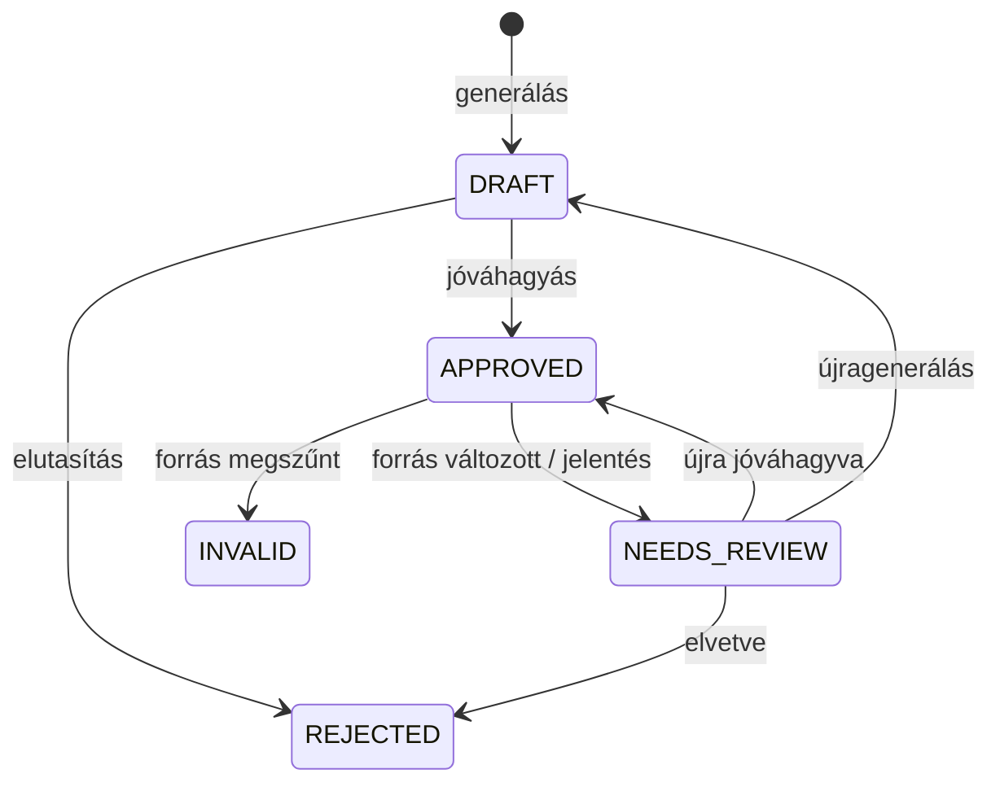
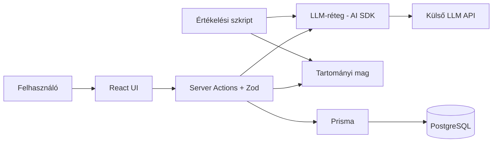

# Tananyaghoz kötött feladatgeneráló és gyakorlóalkalmazás

Kapcsolódó outline: [01-project-outline.md](01-project-outline.md)

## 1. Szereplők és jogosultságok

Az alkalmazásban egyféle felhasználói fiók van. A felhasználó a saját tananyagát tölti fel, ő hagyja jóvá a kérdéseket, és ő gyakorol belőlük. A jóváhagyás a forrásrészlettel való összevetést jelenti, ehhez nem kell az anyag előzetes ismerete.

| Szerep | Igény | Felelősség / hozzáférés |
| --- | --- | --- |
| Felhasználó (diák, hallgató) | A saját jegyzetéből szeretne megbízható gyakorlófeladatokkal gyakorolni vagy számonkérésre készülni | Feltölti és módosítja a tananyagát, jóváhagyja a részleteket és a kérdéseket, gyakorlósorokat old meg, követi a haladását, és jelentheti a hibás kérdést vagy értékelést. Csak a saját adataihoz fér hozzá. |
| Szerző (fejlesztő) | A generálás, az értékelés és az összeállítás mérhető összehasonlítása | Összeállítja az ellenőrzött tesztkészletet, és parancssori szkripttel futtatja az értékelési eljárást. |
| Témavezető / értékelő | A sikerkritériumok és a megvalósítás minőségének ellenőrzése | A felhasználói felületen kipróbálja a fő folyamatokat, és a mintaadatokon újrafuttathatja az értékelést. |

## 2. Use case-ek / user storyk

### UC1: Tananyag feltöltése

- **Szereplő:** Felhasználó
- **Előfeltétel:** A felhasználó be van jelentkezve.
- **Fő folyamat:**
  1. A felhasználó feltölt egy szöveges tananyagot (.txt, .md, .docx vagy szövegréteggel rendelkező PDF), vagy beilleszti a szövegét.
  2. A rendszer kinyeri a szöveget és a felismerhető címsorokat.
  3. A felhasználó ellenőrzi a kinyert szöveget, és szükség esetén javítja.
  4. A rendszer részletekre bontja a szöveget. Ha vannak benne címsorok, azok mentén, ha nincsenek, bekezdéscsoportok mentén. Minden részlethez kulcsot, témát és tartalom-hash-t rendel.
  5. A felhasználó átnézi és jóváhagyja a részleteket.
- **Alternatív / hibafolyamatok:** Hibás, üres vagy szövegréteg nélküli (szkennelt) fájl esetén a rendszer hibát jelez, és nem hoz létre verziót.
- **Utófeltétel:** A tananyag első verziója és jóváhagyott részletei eltárolódtak.

### UC2: Kérdések generálása és jóváhagyása

- **Szereplő:** Felhasználó
- **Előfeltétel:** A tananyagnak van jóváhagyott részlete.
- **Fő folyamat:**
  1. A felhasználó kiválaszt egy témát, a kérdéstípust, a nehézséget és a darabszámot.
  2. A rendszer szerveroldalon meghívja az LLM-et, sémával validálja a választ, és ellenőrzi, hogy a forrásidézet szó szerint szerepel-e a részletben.
  3. A rendszer megjelöli a meglévőkhöz közel azonos kérdéseket, és az érvényeseket vázlatként menti.
  4. A felhasználó a kiemelt forrásidézettel összevetve jóváhagyja, javítja vagy elutasítja a kérdéseket.
- **Alternatív / hibafolyamatok:** Hibás vagy idézet nélküli LLM-kimenet nem mentődik. Ha az LLM nem érhető el, a rendszer hibát jelez, a meglévő adatok változatlanok maradnak.
- **Utófeltétel:** A jóváhagyott kérdések a feladatbankba kerülnek, az eredeti AI-változat és a kézi javítás is megmarad.

### UC3: Tananyag módosítása

- **Szereplő:** Felhasználó
- **Előfeltétel:** Létezik tananyag jóváhagyott kérdésekkel.
- **Fő folyamat:**
  1. A felhasználó feltölti a tananyag új változatát.
  2. A rendszer kulcs és hash alapján összeveti a részleteket az előző verzióval.
  3. A megváltozott részletek kérdései felülvizsgálandók, a megszűnt részletek kérdései érvénytelenek lesznek, és kikerülnek a gyakorlásból.
  4. A felhasználó a felülvizsgálandó kérdést újra jóváhagyja, javítja, elveti vagy újragenerálja. Újrageneráláskor az új tervezet a korábbi kézi javítás mellett jelenik meg.
- **Utófeltétel:** A feladatbankban csak a tananyag aktuális verziójához hű kérdések vannak.

### UC4: Gyakorlás és értékelés

- **Szereplő:** Felhasználó
- **Előfeltétel:** A feladatbankban van jóváhagyott kérdés.
- **Fő folyamat:**
  1. A felhasználó kiválasztja a témákat, a nehézséget és a feladatszámot.
  2. A rendszer seed alapján összeállítja a sort a témalefedettség és a korábbi próbálkozások figyelembevételével, a duplikátumok kizárásával.
  3. A felhasználó kitölti és beadja a sort.
  4. A rendszer a feleletválasztós válaszokat determinisztikusan, a rövid válaszokat rubric alapján AI-val értékeli, majd megmutatja az eredményt a forrásrészlettel.
- **Alternatív / hibafolyamatok:**
  - Ha nincs elég kérdés, a rendszer megnevezi a nem teljesíthető feltételt, és kisebb sort ajánl.
  - A bizonytalan AI-értékelés felülvizsgálati jelzést kap, és a felhasználó elfogadásáig nem számít bele a haladásba.
  - A felhasználó jelentheti a hibás kérdést vagy értékelést. A jelentett kérdés felülvizsgálandó lesz, a jelentett értékelés kimarad az eredményből.
- **Utófeltétel:** A válaszok és a témánkénti eredmény eltárolódtak.

### UC5: Haladás megtekintése

- **Szereplő:** Felhasználó
- **Fő folyamat:** A felhasználó témánként látja az eredményességét és a gyenge témáit, és ezekből új gyakorlósort indíthat.

### Kérdés életciklusa

## 3. Funkcionális követelmények

| Követelmény | Elfogadási kritérium | Prioritás |
| --- | --- | --- |
| A felhasználó szöveges tananyagot tölthet fel (.txt, .md, .docx, szöveges PDF) vagy illeszthet be, amelyből a rendszer kinyeri a szöveget és részletekre bontja. | Adott érvényes fájl, a rendszer verziót hoz létre, és minden részlet kulcsot és hash-t kap. Ugyanaz a bemenet mindig ugyanazokat a részleteket adja. | Kötelező |
| Kérdés csak jóváhagyott részletből generálható, és a forrására hivatkozik. | Minden mentett kérdés tartalmazza a részlet azonosítóját, verzióját és hash-ét, a forrásidézete pedig szó szerint szerepel a részletben. | Kötelező |
| A generálás teljes dokumentum és visszakeresett részletek módban is futtatható. | Mindkét módban keletkeznek kérdések, és rögzül a mód, az idő és a tokenfelhasználás. | Kötelező |
| Érvénytelen LLM-kimenet nem kerül az adatbázisba. | Sémának nem megfelelő válasznál nem jön létre kérdés, a hiba naplózódik. | Kötelező |
| A rendszer felismeri a közel azonos kérdéseket. | A küszöbnél hasonlóbb kérdések egy csoportba kerülnek, és egy sorba csoportonként legfeljebb egy kerül. | Kötelező |
| Kérdés csak jóváhagyás után kerül a feladatbankba, és jóváhagyás előtt szerkeszthető. | Vázlat kérdés nem jelenik meg gyakorlósorban. A szerkesztett változat validálva mentődik, az AI-eredeti megmarad. | Kötelező |
| A nehézségi kategóriák szerkeszthetők. | A felhasználó kategóriát hozhat létre, nevezhet át, és módosíthatja a kérdés kategóriáját. | Kötelező |
| Tananyagváltozáskor az érintett kérdések kikerülnek a gyakorlásból, és az állapotuk látható. | Megváltozott forrásnál a kérdés felülvizsgálandó, megszűntnél érvénytelen lesz. A nem érintett kérdések változatlanok. | Kötelező |
| Újrageneráláskor a kézi javítás összevethető az új tervezettel. | A két változat egymás mellett, a különbségek kiemelésével jelenik meg. | Kötelező |
| A gyakorlósor feltételek szerint, reprodukálhatóan áll össze. | Azonos seed, paraméterek és feladatbank-állapot esetén a sor azonos. Elégtelen feladatbanknál a rendszer megnevezi a nem teljesíthető feltételt. | Kötelező |
| A véletlenszerű összeállítás összehasonlító módszerként elérhető. | Ugyanazzal a seeddel mindkét módszer lefuttatható. | Kötelező |
| A feleletválasztós értékelés determinisztikus, a rövid válaszoké rubric alapú. | Feleletválasztósnál nincs LLM-hívás. Rövid válasznál szempontonkénti pont és indoklás mentődik, bizonytalan esetben jelzéssel. | Kötelező |
| A felhasználó jelentheti a hibás kérdést vagy értékelést. | A jelentés típussal rögzül, a kérdés kikerül a gyakorlásból, illetve a válasz az eredményből. | Kötelező |
| A felhasználó témánként követheti a haladását. | A válaszok és a témánkénti eredmény újratöltés után is elérhetők. | Kötelező |
| Létezik reprodukálható értékelési eljárás. | Ugyanazzal a konfigurációval és mentett LLM-kimenetekkel két futás azonos eredményt ad. | Kötelező |
| Az eredmény kérdésenként megjeleníti a magyarázatot és a forrásrészletet. | Adott egy értékelt válasz, az eredményoldalon a kérdés magyarázata és forrásrészlete látható. | Ajánlott |
| A felhasználó a haladás oldalon egy gyenge témából közvetlenül új gyakorlósort indíthat. | Adott egy gyengének jelölt téma, a gyakorlás indításakor a beállítás erre a témára előtöltődik. | Ajánlott |
| A rendszer prezentációs anyagból (.pptx) is kinyeri a szöveget. | Adott egy .pptx fájl, a diák szövege és az előadói jegyzetek kinyerődnek, a diák címei címsorként szolgálnak. | Lehetséges |

A **Kötelező** prioritás a végtermékhez szükséges elemet jelöl, az **Ajánlott** fontosat, a **Lehetséges** pedig olyat, ami csak idő esetén készül el.

## 4. Üzleti szabályok és korlátok

| Szabály vagy korlát | Indoklás |
| --- | --- |
| Minden kérdés egy jóváhagyott részlet adott verziójához kötődik, és szó szerinti forrásidézetet tartalmaz. | Visszakövethetőség és automatikusan ellenőrizhető forráshoz köthetőség. |
| A kérdés állapota csak az életciklus-diagram átmeneteivel változhat, és gyakorlásba csak jóváhagyott kérdés kerülhet. | Hibás, jelentett vagy elavult kérdés nem jut el a felhasználóhoz. |
| A rendszer azt garantálja, hogy a kérdés a tananyaghoz hű, azt nem, hogy a tananyag helyes. | A jóváhagyás a forrással való összevetés, nem szakértői ítélet. |
| A rövid válaszos kérdésnek kötelező referencia-válasza és rubricja van. Az értékelés bizonytalan, ha a független pontozások eltérnek, vagy a pontszám a megfelelési határ közelébe esik. | Az LLM saját magabiztossága nem megbízható, ezért a bizonytalanságot mérni kell. |
| A gyakorlósor eltárolja a seedet, a paramétereket és a kiválasztott kérdések azonosítóit. | Reprodukálhatóság a feladatbank későbbi változása után is. |
| A tartományi logika nem függ a felülettől, az adatbázistól és az LLM-től. | Tesztelhetőség és reprodukálhatóság. |
| LLM-hívás csak szerveroldalon történik, API-kulcs és személyes adat nem kerülhet a repóba. | Biztonság. |

## 5. Felhasználói felület és munkafolyamat

A felület jelenleg csak kezdeti, demó jellegű tervezet, a pontos képernyőket és elrendezést a 2. prezentációig wireframe-ek vagy prototípus formájában dolgozom ki. Az elképzelés egy mobilon és asztali gépen is használható webes felület négy fő menüponttal (Tananyagok, Gyakorlás, Haladás, Felülvizsgálat). A legfontosabb képernyő a jóváhagyási nézet, ahol a generált kérdés és a forrásrészlet egymás mellett látható, a forrásidézet kiemelésével. A fő folyamatban a felhasználó feltölti a jegyzetét, jóváhagyja a részleteket és a kérdéseket, majd gyakorol és követi a haladását.

## 6. Nem funkcionális követelmények

| Követelmény | Ellenőrzés módja |
| --- | --- |
| A gyakorlósor és a darabolás reprodukálható, azonos bemenetre azonos eredményt ad. | Automatizált tesztek két futás összehasonlításával. |
| Az AI hibája vagy elérhetetlensége nem okoz adatvesztést. | Integrációs teszt mockolt, hibázó LLM-mel. |
| A tartományi logika adatbázis, felület és LLM nélkül tesztelhető. | A tesztek külső függőség nélkül lefutnak. |
| A rövid válaszok AI-pontozása a kézzel ellenőrzött mintákon legalább x%-ban egyezik (x egyeztetendő). | Értékelési eljárás a tesztkészleten. |
| A felület 360 px szélességtől használható, és új felhasználó dokumentáció nélkül ki tud tölteni egy sort. | Kézi teszt és megfigyeléses teszt. |
| A repóban futtatási útmutató és mintaadat van, titkos kulcs nincs. | Futtatás tiszta környezetben, secret scanning. |

## 7. Nyitott kérdések és kockázatok

| Kérdés / kockázat | Hatás | Felelős | Feloldás / döntés |
| --- | --- | --- | --- |
| Jól értelmezem-e, hogy a jóváhagyó és a gyakorló ugyanaz a felhasználó? | A szerepmodell és a hatókör. | Szerző, témavezető | Egyeztetendő. A brief szövege erre utal. |
| A felhasználó észreveszi-e a hibás kérdést, ha éppen tanulja az anyagot? | Hibás kérdés kerülhet a feladatbankba. | Szerző | Forrásidézet kiemelése és automatikus ellenőrzése, utólagos jelentés. A kiértékelés méri a jóváhagyott hibás kérdések arányát. |
| Mit jelent a „jóváhagyott tananyagegység”? | A részletek jóváhagyási lépése. | Szerző, témavezető | Egyeztetendő. Jelenleg a felhasználó a darabolás után jóváhagyja a részleteket. |
| Kell-e bejelentkezés? | Adatok elkülönítése. | Szerző, témavezető | Egyeztetendő. Egyszerű e-mail-jelszavas bejelentkezéssel számolok. |
| Melyik LLM-szolgáltatót és modellt használjam? | Magyar nyelvi minőség és a strukturált kimenet megbízhatósága. | Szerző, témavezető | Egyeztetendő. Az AI SDK miatt a modell cserélhető, ezért több modell is kipróbálható a prototípusban. |
| Melyik tantárgy anyaga legyen a tesztkészlet? | A kutatási rész alapja. | Szerző, témavezető | Egyeztetendő. Egy tantárgy néhány fejezete, külön fejlesztési és kiértékelési részre bontva. |
| Mekkora egyezést várjunk el az AI-pontozás és a kézi pontozás között? | Ez a 6. szakasz x% értéke. | Szerző, témavezető | Egyeztetendő. Javaslat: legfeljebb egypontos eltérés számít egyezésnek, célérték 80%, az első mérések után pontosítva. |
| Elfogadható-e a brief költségre vonatkozó mérése tokenfelhasználásként? | A brief kötelezően kéri a költség szerinti összehasonlítást. | Szerző, témavezető | Egyeztetendő. A tokenfelhasználás pénzösszeg nélkül is kifejezi az erőforrásigényt. |
| Milyen fájltípusok tölthetők fel? | A szövegkinyerés összetettsége és a darabolás módja. | Szerző, témavezető | Egyeztetendő. A terv a .txt, .md, .docx és a szöveges PDF-fájlokkal számol. Kérdés, hogy a prezentációalapú anyagok (.pptx) feldolgozására is szükség van-e. |

## 8. Kezdeti technikai javaslat

### Javasolt megoldás

A rendszer egyetlen Next.js alkalmazás. A tartományi mag tiszta TypeScript modul, amely a darabolást, a hash-elést, a kérdések állapotátmeneteit, az érvénytelenítést, a forrásidézet-ellenőrzést, a duplikátumszűrést, a seedelt összeállítást és a feleletválasztós értékelést végzi. Erre épül a szerveroldali réteg (Server Actions, Zod-validáció, Prisma, szövegkinyerés, LLM-hívások, visszakeresés) és a React kliens. Az értékelési szkript ugyanazt a magot és LLM-réteget használja, így azt méri, amit az alkalmazás ténylegesen csinál.

### Kutatási kérdések

| Vizsgálat | Összehasonlított változatok | Mért értékek |
| --- | --- | --- |
| Generálás kontextusa | Teljes dokumentum, illetve visszakeresett részletek (RAG) | Sémabeli érvényesség, forráshoz köthetőség, tartalmi helyesség, megválaszolhatóság, a referencia-válasz helyessége, ismétlődés, kézi javítási igény, késleltetés, tokenfelhasználás |
| Rövid válaszok értékelése | AI-pontszám, illetve kézzel ellenőrzött pontszám | Egyezési arány, a bizonytalansági jelzés pontossága |
| Feladatsor-összeállítás | Véletlenszerű, illetve feltételes | Témalefedettség, ismétlés, teljesíthetőség, összeállítási idő |

### Technológiai irány

| Terület | Jelölt technológia / megközelítés | Megfontolás oka | Nyitott kérdés / kockázat |
| --- | --- | --- | --- |
| Alkalmazás | Next.js App Router, React, TypeScript | Egy kódbázis kliensnek és szervernek | — |
| Adat | PostgreSQL, Prisma, Zod | Típusos, validált adatfolyam az LLM-től az adatbázisig | — |
| Hitelesítés | Better Auth vagy Auth.js, e-mail és jelszó | Kész, Next.js-hez illeszkedő megoldás, nem kell saját munkamenet-kezelést írni | A szerepmodell egyeztetése után véglegesíthető. |
| Szövegkinyerés | Jelölt könyvtárak: mammoth (.docx), pdfjs-dist (PDF) | Kiforrott, JavaScriptből használható eszközök | A PDF-ekből a címsorok és a szerkezet csak részben nyerhető ki. |
| Visszakeresés | PostgreSQL teljes szöveges keresés magyar nyelvi konfigurációval, szükség esetén pgvector | Nem kell külön szolgáltatás | A magyar szótövezés minősége. A pgvector a Prismában csak nyers SQL-lel érhető el. |
| AI | Vercel AI SDK, strukturált kimenet közvetlenül Zod-sémával | Szolgáltatófüggetlen, a Zod-sémát kész formában fogadja, és tesztben mockolható | A szolgáltató és a modell kiválasztása. |
| Tesztelés | Vitest, mockolt LLM, a fő folyamatokra Playwright | Gyors, determinisztikus egységtesztek és néhány végponttól végpontig tartó teszt | — |
| Futtatás | Docker Compose, saját Node-szerver, hosszú generáláshoz szükség esetén PostgreSQL-alapú feladatsor (pg-boss) | Nincs serverless időkorlát, a környezet reprodukálható | A háttérfeladat csak akkor kell, ha a generálás túl hosszú egy kéréshez. |

### Kezdeti architektúravázlat

### Megvalósíthatóság és technikai kockázatok

| Kockázat / feltételezés | A 2. félévre tervezett validáció | Tartalék megközelítés |
| --- | --- | --- |
| Az LLM megbízhatóan ad sémának megfelelő magyar kérdéseket szó szerinti idézettel. | Prototípus egy fejezeten, a séma- és idézethibák mérése. | Strukturált kimenet, szigorúbb prompt, toleránsabb idézetkeresés. |
| A PDF- és Word-fájlokból kinyert szöveg elég tiszta a daraboláshoz (élőfejek, oldalszámok, többhasábos tördelés nélkül). | Néhány valós jegyzet feldolgozása és a kinyert szöveg kézi ellenőrzése. | A felhasználó a darabolás előtt javíthatja a kinyert szöveget, végső esetben a bemenet sima szövegre és Markdownra szűkül. |
| A részletek két verzió között megbízhatóan párosíthatók, címsorok nélküli szövegben is. | Tipikus módosítások (javítás, beszúrás, átrendezés) után az érvénytelenített kérdések ellenőrzése, címsoros és címsor nélküli tananyagon is. | Szöveghasonlóság alapú párosítás vagy kézzel megadott részletazonosítók. |
| Az AI-pontozás elfogadhatóan egyezik az emberivel. | Kézzel pontozott mintakészlet összevetése. | Szigorúbb bizonytalansági küszöb. |
| Az LLM-kimenet változása miatt a kísérletek nem reprodukálhatók. | A modell- és promptverzió, valamint a nyers kimenet rögzítése. | Kiértékelés a mentett kimenetekből. |
